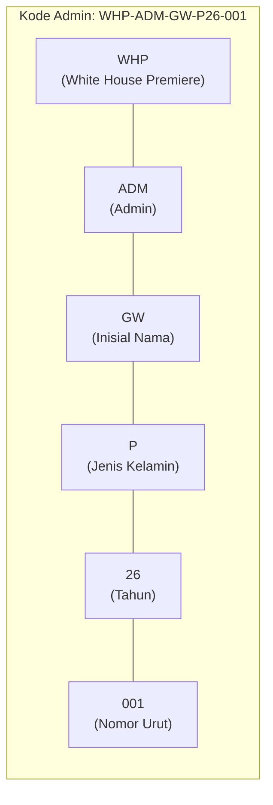

# LAPORAN SKENARIO — Generate & Kelola Kode Admin

**Use Case Name** : Generate dan Kelola Kode Admin

**Requirements** : Sistem dapat menghasilkan kode admin unik secara otomatis berdasarkan inisial nama, jenis kelamin, dan tahun pendaftaran

**Goal** : Setiap admin memiliki kode unik dengan format WHP-ADM-{INISIAL}-{JK}{TAHUN}-{URUTAN} untuk keperluan laporan dan identifikasi

**Pre-conditions** :
1. User dengan role admin telah terdaftar di sistem
2. Role admin ditentukan melalui kolom `role` pada tabel `users`
3. Migration kolom `kode_admin` dan `jenis_kelamin` sudah dijalankan

**Post-conditions** :
1. Admin memiliki kode unik sesuai format yang ditentukan
2. Kode admin tersimpan di kolom `kode_admin` pada tabel `users`
3. Admin dapat di-filter dan dicari berdasarkan kode admin
4. Laporan data admin dapat dicetak dan diexport PDF

**Failed end condition** :
1. Nama admin kosong saat generate → Menggunakan inisial "XX"
2. Jenis kelamin tidak diisi saat generate → Default ke "P" (Perempuan)
3. Duplikat kode admin → Sistem menggunakan nomor urut berikutnya secara otomatis
4. User bukan admin saat regenerate → Error "User ini bukan admin"
5. Order by kode_admin gagal → Nomor urut dimulai dari 001

**Actors** :
1. Admin Panel — Halaman laporan admin yang menampilkan data admin
2. Sistem — Aplikasi web White House Premiere
3. Developer / Super Admin — Pengguna yang mengelola data admin

**Main Flow Path**

1. Sistem mendeteksi pembuatan user baru dengan role `admin`
2. Model event `creating` pada User terpanggil
3. Fungsi `generateKodeAdmin()` membaca nama admin
4. Inisial diambil dari 2 huruf pertama setiap kata pada nama
   - Contoh: "Giescha Wiwenar" → inisial "GW"
   - Contoh: "Bambang" → inisial "BA"
5. Jenis kelamin ditentukan dari input (P/L), default "P" jika kosong
6. Tahun diambil dari 2 digit tahun saat ini
   - 2026 → "26"
7. Sistem mencari kode admin terakhir dengan pola yang sama
   - Query: `WHP-ADM-GW-P26-%`
   - Jika ditemukan "WHP-ADM-GW-P26-001" → urutan "002"
   - Jika tidak ditemukan → urutan "001"
8. Kode akhir digabung: `WHP-ADM-GW-P26-001`
9. Kode disimpan ke database bersama data user

**Alternatif Flow (Update Role)**
1. User yang sudah ada di-update role-nya menjadi `admin`
2. Model event `updating` mendeteksi perubahan pada kolom `role`
3. Jika `kode_admin` masih kosong, generate kode otomatis dijalankan
4. Kode baru digenerate dan disimpan

**Format Detail**

| Bagian | Panjang | Keterangan | Contoh |
|--------|---------|------------|--------|
| WHP | 3 | White House Premiere | WHP |
| ADM | 3 | Prefix Admin | ADM |
| INISIAL | 2 | Huruf awal nama | GW |
| JK | 1 | Jenis Kelamin (P/L) | P |
| TAHUN | 2 | 2 digit tahun | 26 |
| URUTAN | 3 | Nomor urut (001-999) | 001 |

Contoh lengkap: **WHP-ADM-GW-P26-001**

**Tabel Perubahan Basis Data**

```sql
-- Migration: add_kode_admin_to_users_table
ALTER TABLE users ADD COLUMN kode_admin VARCHAR(255) UNIQUE NULL AFTER role;
ALTER TABLE users ADD COLUMN jenis_kelamin ENUM('P', 'L') NULL AFTER kode_admin;
```

** Diagram Alur Generate Kode Admin **

```mermaid
flowchart TD
    A[Mulai: Admin Baru Dibuat] --> B{Role = admin?}
    B -->|Ya| C[kode_admin kosong?]
    B -->|Tidak| Z[Selesai - Tidak digenerate]
    C -->|Ya| D[Ambil Nama Admin]
    C -->|Tidak| Z
    D --> E[Generate Inisial dari Nama]
    E --> F[Ambil Jenis Kelamin]
    F --> G[Ambil Tahun Saat Ini]
    G --> H[Cari Kode Terakhir dengan Pola Sama]
    H --> I{Ada kode sebelumnya?}
    I -->|Ya| J[Increment nomor urut +1]
    I -->|Tidak| K[Set nomor urut = 001]
    J --> L[Gabung Kode: WHP-ADM-{INISIAL}-{JK}{THN}-{URUTAN}]
    K --> L
    L --> M[Simpan kode_admin ke Database]
    M --> Z
```

** Diagram Komponen Kode Admin **



** Visual Struktur Kode Admin **

File diagram SVG: `struktur_kode_admin.svg` (buka di browser untuk tampilan grafis)

```
Kode Admin : WHP-ADM-GW-P26-001

```
Kode Admin : WHP-ADM-GW-P26-001
    ├── WHP        : White House Premiere (prefix perusahaan)
    ├── ADM        : Admin (prefix role)
    ├── GW         : Inisial Nama Admin (Giescha Wiwenar)
    ├── P          : Jenis Kelamin (P = Perempuan, L = Laki-laki)
    ├── 26         : Tahun Pendaftaran (2026)
    └── 001        : Nomor Urut (001, 002, ...)
```

---

**Referensi** :
- Model : `app/Models/User.php` (baris 100-147)
- Controller : `app/Http/Controllers/Admin/AdminReportController.php`
- Migration : `database/migrations/2026_06_08_000001_add_kode_admin_to_users_table.php`
- Halaman : `resources/views/admin/laporan/index.blade.php`
- Export PDF : `resources/views/admin/laporan/pdf.blade.php`
- Command : `app/Console/Commands/GenerateKodeAdmin.php` via `php artisan admin:generate-kode`
- Endpoint : `GET|POST /admin/laporan-admin`

*Dokumen ini disusun berdasarkan analisis kode pada User Model & Admin Report Controller White House Premiere.*
